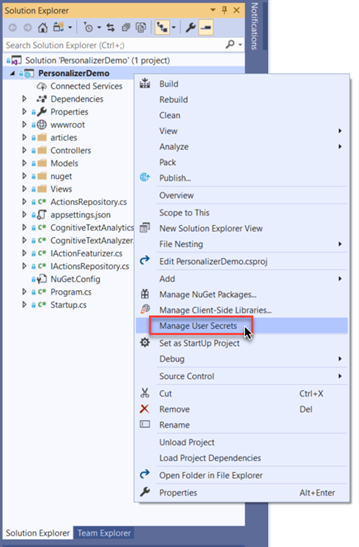

# Personalizer Business Demo

This interactive demo shows how Personalizer chooses content, and how the application teaches the service to improve suggestions based on rewards.

The solution is an [ASP.NET Core MVC 2.2](https://docs.microsoft.com/en-us/aspnet/core/mvc/overview?view=aspnetcore-2.2), that has a single page divided in two columns.

On the left side there is a simulated news page that displays some article of interest when you click "Personalize", picking it out of five possible articles.

The 3 articles are the 3 possible "actions" for Personalizer to take, and you can see what features that are being used for each in JSON format. The demo lets you simulate some context features such as Referrer, tournament and device, which are also shown in JSON format. Features of actions and context will be used by Personalizer to choose the best article. The Rank API call returns the article the application should show in the rewardActionId attribute.

In this demo, reward is computed by seeing how far down the user scrolls. This reward score will be sent when it reaches 1, or the application will wait up to one minute from the time the article was shown before a lower number gets used in a Reward API call.


# To try this sample

- Clone the Azure Personalization Service.

    ```bash
    git clone https://github.com/Azure-Samples/cognitive-services-personalizer-samples.git
    ```

- Navigate to _demos/PersonalizerBusinessDemo_.

- Open `PersonalizerBusinessDemo.sln`.


## Prerequisites

- [.NET Core 2.2](https://dotnet.microsoft.com/download/dotnet-core/2.2)
- (optional) [Visual Studio 2019](https://visualstudio.microsoft.com/vs/)

### Set up Personalization Service

1. Navigate to [Getting Started with Personalization](https://docs.microsoft.com/en-us/azure/cognitive-services/personalizer/how-to-settings).

1. Follow the instructions to get the endpoint and key to your Personalization Loop.

1. Configure the `PersonalizationApiKey` with the loop `Key` from your service as [app secrets](https://docs.microsoft.com/en-us/aspnet/core/security/app-secrets).

    > **Note:** if you are using the .NET Core CLI, you can use the `dotnet user-secrets set "PersonalizationApiKey" "<API Key>"` command.

1. Open the `appsettings.json` file and replace the value of the `PersonalizationEndpoint` property with your Personalizer Service Endpoint URL.


### Set up Cognitive Services Text Analytics

1. Navigate to [Microsoft Azure Cognitive Services](https://azure.microsoft.com/en-us/try/cognitive-services/).

1. Click on `Language APIs` tab.

1. Click on `Get API Key` button and select the account you want to sign in with.

1. Configure the `TextAnalyticsKey` with on of the `Key` from your service as [app secrets](https://docs.microsoft.com/en-us/aspnet/core/security/app-secrets).

    > **Note:** if you are using the .NET Core CLI, you can use the `dotnet user-secrets set "TextAnalyticsKey" "<API Key>"` command.

1. Open the `appsettings.json` file and replace the value of the `TextAnalyticsEndpoint` property with your Text Analytics Endpoint URL.

### Using Visual Studio to configure the secrets

If you are using Visual Studio for running this project, you can right-click the project and select the **Manage User Secrets** menu option to configure the Personalizer and Text Analytics keys.



By doing this, Visual Studio will open a `secrets.json` file where you will need to add the keys as following.

```JSON
{
  "PersonalizationApiKey": "<your personalizer key here>",
  "TextAnalyticsKey": "<your text analytics key here>"
}
```

## Running the demo

Once you configure the secrets and the endpoints, in Visual Studio you can run the project by pressing `F5`. If you are using the .NET Core CLI, run `dotnet run` in the path where the `.csproj` file is.

## Configurations

The following settings can be easily modified from `config/general.json`:

* Navigation Bar items

* Backstage

  * Sign Up label and link
  * Documentation label and link
  * Developer Docs label and link
  * Code sample label and link
  * Backstage button text
  * Request and Response labels

* Toggle to start with an article selected with Personalizer

  